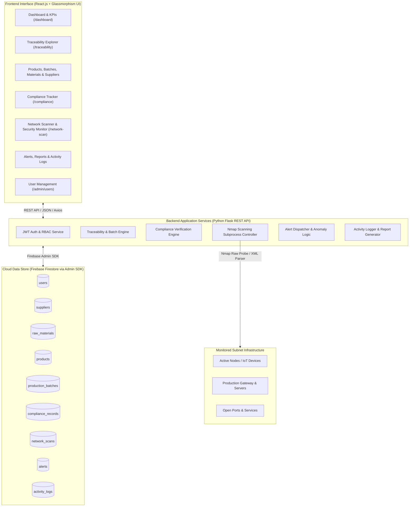

# Sentinel-Trace: Intelligent Product Traceability, Compliance Monitoring & Network Security Management System

[](https://github.com)
[](https://github.com)
[](https://github.com)
[](https://github.com)

---

## 📌 Project Overview & Metadata

* **Project Title:** Sentinel-Trace: Intelligent Product Traceability, Compliance Monitoring, and Network Security Management System
* **Academic Program:** B.Sc. Computer Science with Data Analytics
* **Institution:** KPR College of Arts Science and Research, Arasur, Coimbatore – 641407
* **Department:** Department of Computer Science with Data Analytics
* **Candidate:** Pughalvanan C (Reg. No.: `2428B0336`)
* **Project Guide:** Mr. B. Ramesh Kumar, M.Sc., MCA, M.Phil., NET, SET, (Ph.D.), Assistant Professor
* **Academic Session:** 2025 – 2026 (Phase 2 Submission: October 2026)

---

## 📖 Executive Synopsis

In modern industrial and manufacturing environments, operations heavily depend on supply chains, raw materials, regulated compliance frameworks, and interconnected operational technology (OT/IT) networks. Traditional tracking and monitoring systems are severely fragmented:
- **Product information & supply chain data** are kept in siloed spreadsheets and paper trails.
- **Compliance verification** is performed through periodic, manual inspections prone to delays and gaps.
- **Network infrastructure and connected devices** are monitored separately using command-line utilities, without unified context.

**Sentinel-Trace** resolves these challenges by delivering an integrated, web-based digital platform. It unifies **end-to-end product traceability**, **regulatory compliance tracking**, and **Nmap-driven network security scanning** within a centralized glassmorphic executive interface backed by **Python Flask**, **React.js**, and **Google Cloud Firebase Firestore**.

---

## 🏗️ System Architecture & Data Flow



---

## 🧭 Page & Route Directory

The application UI is structured into modular functional groups accessible via a persistent navigation dock:

| Section | Route | Page Title | Key Capabilities |
| :--- | :--- | :--- | :--- |
| **Overview** | `/dashboard` | **Executive Dashboard** | Real-time KPI counters, health scores, live activity feeds, threat gauges, and quick action shortcuts. |
| **Traceability** | `/traceability` | **Traceability Explorer** | Interactive multi-tier supply chain lineage graph, batch drill-down, and forward/backward genealogy search. |
| | `/products` | **Product Catalog** | Product lifecycle profiles, SKU registry, status flags, and component manifests. |
| | `/batches` | **Production Batches** | Batch codes, material consumption ties, QA clearance status, and timestamps. |
| | `/materials` | **Raw Materials** | Raw material registry, batch inventory levels, supplier links, and unit metrics. |
| | `/suppliers` | **Supplier Directory** | Approved vendor records, contact details, compliance ratings, and order history. |
| **Compliance** | `/compliance` | **Compliance Tracker** | Regulatory audits (ISO, GMP, RoHS), certification expiries, inspection checklists, and status badges. |
| **Network Security** | `/network-scan` | **Network Scanner** | Target subnet configuration, automated Nmap scanning execution, open port discovery, and host census. |
| | `/network-security` | **Security Monitor** | Threat vulnerability levels, unrecognized host alerts, active service monitoring, and perimeter health. |
| **Monitoring & Reports** | `/alerts` | **Alerts & Notifications** | Multi-level alerts (Critical, Warning, Info), status triage (Acknowledge, Resolve, Dismiss). |
| | `/reports` | **Analytics & Reports** | Visual trend curves, batch throughput metrics, PDF/CSV export engine for audit records. |
| | `/activity-logs` | **Activity Logs** | Immutable audit trail tracking user interactions, scan triggers, record mutations, and timestamps. |
| **Administration** | `/admin/users` | **User Management** | Role-Based Access Control (Admin, Inspector, Auditor, Operator), member invites, and credential lifecycle. |

---

## 💻 Technical Specifications

### Hardware Configuration (Development & Benchmark Environment)
* **Host Device:** Jack (`64-bit OS, x64-based processor`)
* **Processor:** AMD Ryzen 5 5500U with Radeon Graphics @ 2.10 GHz (or Intel Core i5 multi-core)
* **RAM:** 16.0 GB DDR4 (8.0 GB minimum required)
* **Storage:** 256 GB High-speed NVMe SSD
* **Peripheral Support:** Barcode / QR scanner interface, Webcam capture module

### Software Configuration & Environment
* **Operating System:** Windows 11 Pro / 64-bit
* **Frontend Framework:** React.js (Vite runtime), Vanilla CSS3 Design System with Glassmorphism
* **Backend Runtime & Framework:** Python 3.10+ with Flask (RESTful Architecture)
* **Database Management:** Google Cloud Firebase Firestore
* **Database Driver / SDK:** `firebase-admin` (Python SDK)
* **Security Scanner Engine:** Nmap (Network Mapper) v7.9x+
* **API Communication:** RESTful JSON APIs via `fetch` / `axios`
* **Development & Tooling:** Visual Studio Code, Postman API Suite, Google Chrome DevTools

---

## 🗄️ Database Schema (Firebase Firestore Collections)

### 1. `users`
| Field Name | Type | Description | Sample Data |
| :--- | :--- | :--- | :--- |
| `user_id` | String | Unique user identifier | `"U101"` |
| `username` | String | Operator display username | `"jack"` |
| `email` | String | Corporate email address | `"user@sentineltrace.io"` |
| `password_hash` | String | Salted SHA-256 / bcrypt hash | `"$2b$12$e..."` |
| `role` | String | RBAC Access Role | `"Admin"`, `"Inspector"`, `"Auditor"` |
| `created_at` | Timestamp | Account creation timestamp | `2026-09-25T10:00:00Z` |

### 2. `suppliers`
| Field Name | Type | Description | Sample Data |
| :--- | :--- | :--- | :--- |
| `supplier_id` | String | Supplier registration identifier | `"SUP101"` |
| `supplier_name` | String | Commercial vendor name | `"Apex Precision Metallurgy"` |
| `contact` | String | Primary phone contact | `"+91 9943062711"` |
| `email` | String | Point-of-contact email | `"vendor@apexmeta.com"` |
| `address` | String | Facility physical address | `"Industrial Estate, Coimbatore"` |
| `status` | String | Approval / Tier status | `"Verified / Active"` |
| `created_at` | Timestamp | Vendor registration date | `2026-09-18T08:30:00Z` |

### 3. `raw_materials`
| Field Name | Type | Description | Sample Data |
| :--- | :--- | :--- | :--- |
| `material_id` | String | Material catalog code | `"RM301"` |
| `material_name` | String | Commercial material specification | `"Aircraft Grade Steel Sheet 316L"` |
| `supplier_id` | String | Linked supplier foreign key | `"SUP101"` |
| `quantity` | Number | Current stock volume | `1250` |
| `unit` | String | Unit of measurement | `"Kg"`, `"Units"`, `"Liters"` |
| `created_at` | Timestamp | Inventory ingress timestamp | `2026-09-25T14:15:00Z` |

### 4. `products`
| Field Name | Type | Description | Sample Data |
| :--- | :--- | :--- | :--- |
| `product_id` | String | Finished product SKU | `"PRD-401"` |
| `product_name` | String | Commercial product nomenclature | `"Industrial Sentinel Flow Valve"` |
| `product_code` | String | Serialized barcode / QR identifier | `"SEN-VALVE-V4"` |
| `description` | String | Engineering description & specs | `"High-pressure sealed hydraulic regulator"` |
| `status` | String | Lifecycle status | `"In Production"`, `"Certified"`, `"Quarantined"` |
| `created_at` | Timestamp | Catalog entry timestamp | `2026-09-20T11:20:00Z` |

### 5. `production_batches`
| Field Name | Type | Description | Sample Data |
| :--- | :--- | :--- | :--- |
| `batch_id` | String | Unique production batch number | `"BATCH-101"` |
| `product_id` | String | Associated product SKU | `"PRD-401"` |
| `material_id` | String | Consumed raw material identifier | `"RM301"` |
| `quantity` | Number | Units manufactured | `500` |
| `production_date`| Date | Manufacturing run date | `2026-09-26` |
| `status` | String | Batch inspection status | `"Completed"`, `"In QA Inspection"`, `"Passed"` |
| `created_at` | Timestamp | Run timestamp | `2026-09-26T09:00:00Z` |

### 6. `compliance_records`
| Field Name | Type | Description | Sample Data |
| :--- | :--- | :--- | :--- |
| `compliance_id` | String | Record unique ID | `"CMP-701"` |
| `product_id` | String | Subject product SKU | `"PRD-401"` |
| `standard` | String | Regulatory framework | `"ISO 9001:2015"`, `"RoHS Compliant"` |
| `status` | String | Compliance determination | `"Compliant"`, `"Review Required"`, `"Non-Compliant"` |
| `remarks` | String | Auditor observations | `"Stress test passed under 250 bar pressure"` |
| `audited_by` | String | Lead auditor identifier | `"U101"` |
| `expiry_date` | Date | Recertification due date | `2027-09-26` |

### 7. `network_scans`
| Field Name | Type | Description | Sample Data |
| :--- | :--- | :--- | :--- |
| `scan_id` | String | Network scan execution ID | `"SCAN-101"` |
| `target` | String | Scanned subnet / IP range | `"192.168.1.0/24"` |
| `devices_found` | Number | Discovered responsive hosts | `14` |
| `open_ports` | Array | Exposed port list with services | `[{"port": 80, "service": "http"}, {"port": 22, "service": "ssh"}]` |
| `status` | String | Scan execution status | `"Completed"`, `"Running"`, `"Failed"` |
| `created_by` | String | Initiating security admin | `"U101"` |
| `scan_date` | Timestamp | Scan execution timestamp | `2026-09-26T16:45:00Z` |

### 8. `alerts` & `activity_logs`
* **`alerts`**: Captures severity (`Critical`, `Warning`, `Notice`), source module (`Traceability`, `Compliance`, `Nmap Scanner`), message payload, acknowledgement status, and action timestamps.
* **`activity_logs`**: Records actor ID, action verb (`CREATE`, `UPDATE`, `SCAN_TRIGGER`, `AUTH_LOGIN`), IP address, targeted resource, and timestamp.

---

## 🚀 Installation & Setup Guide

### 1. Prerequisites
* **Python 3.10+** installed and added to `PATH`
* **Node.js v18+ & npm** installed
* **Nmap CLI** installed and accessible via system shell
* A valid **Google Cloud Firebase Service Account Key** JSON file (`serviceAccountKey.json`)

### 2. Backend Setup (Flask API)
```bash
# Navigate to backend directory
cd backend

# Create and activate virtual environment
python -m venv venv
# On Windows:
.\venv\Scripts\activate
# On Linux/macOS:
source venv/bin/activate

# Install dependencies
pip install flask flask-cors firebase-admin python-nmap requests pyjwt

# Place your Firebase credentials in backend/config/serviceAccountKey.json
# Run the Flask development server
python app.py
# Server starts on http://127.0.0.1:5000
```

### 3. Frontend Setup (React.js + Vite)
```bash
# Navigate to frontend directory
cd frontend

# Install packages
npm install

# Start Vite live development server
npm run dev
# App launches on http://localhost:5173
```

---

## 📡 REST API Reference

| Method | Endpoint | Description | Auth Required |
| :--- | :--- | :--- | :--- |
| `POST` | `/api/auth/login` | Authenticate user credentials and return session token | No |
| `GET` | `/api/dashboard/stats` | Retrieve aggregated dashboard counts, health scores, and metrics | Yes |
| `GET` | `/api/traceability/:id` | Fetch hierarchical genealogical lineage for product/batch | Yes |
| `GET` / `POST` | `/api/products` | Query products catalog or register a new product | Yes |
| `GET` / `POST` | `/api/batches` | List batches or record a new production run | Yes |
| `GET` / `POST` | `/api/materials` | Retrieve raw materials or record newly received inventory | Yes |
| `GET` / `POST` | `/api/suppliers` | Manage approved vendor directory | Yes |
| `GET` / `POST` | `/api/compliance` | List regulatory records or record an audit finding | Yes |
| `POST` | `/api/network/scan` | Trigger an asynchronous Nmap sweep on specified CIDR subnet | Yes (Admin) |
| `GET` | `/api/network/history` | Retrieve historical scan reports and open-port inventories | Yes |
| `GET` / `PUT` | `/api/alerts` | Query live system alerts or acknowledge active alarms | Yes |
| `GET` | `/api/logs` | Fetch immutable audit trail for activity logs | Yes (Admin) |
| `GET` / `POST` | `/api/admin/users` | List system users or provision a new team member | Yes (Admin) |

---

## 🧪 Verification & Test Cases (Section 4.2)

The system was evaluated against functional test suites to verify modules, database synchronization, and security execution:

| S.No | Tested Module | Test Input / Action | Expected Result | Result |
| :---: | :--- | :--- | :--- | :---: |
| **1** | **User Registration** | Enter valid operator registration credentials | User authenticated and redirected to appropriate route | **PASSED** |
| **2** | **Invalid Login** | Enter invalid email address or password | Error message displayed; unauthorized access denied | **PASSED** |
| **3** | **Executive Dashboard** | Access `/dashboard` after authentication | Dashboard metrics, KPIs, and status widgets load cleanly | **PASSED** |
| **4** | **Supplier Management** | Submit valid vendor profile to `/suppliers` | Supplier document recorded in Firestore successfully | **PASSED** |
| **5** | **Raw Material Management** | Enter valid raw material data & linked vendor | Material record created and linked with supplier ID | **PASSED** |
| **6** | **Product Management** | Register new product specification | Product record stored in catalog with unique SKU | **PASSED** |
| **7** | **Production Batch** | Create batch linking product SKU and material batch | Batch generated with quantity and lifecycle status | **PASSED** |
| **8** | **Product Traceability** | Query product identifier in Traceability Explorer | Full forward & backward genealogy graph displayed | **PASSED** |
| **9** | **Compliance Monitoring** | Create compliance certification audit record | Compliance record stored and status indicator updated | **PASSED** |
| **10** | **Network Scanning** | Initiate Nmap subnet probe (`/network-scan`) | Connected hosts, open ports, and services enumerated | **PASSED** |
| **11** | **Security Monitoring** | Query Security Monitor interface (`/network-security`) | Real-time threat levels and host alerts displayed | **PASSED** |

---

## 🔮 Future Roadmap (Section 5.1)

1. **Native Mobile Application:** Cross-platform iOS/Android app with integrated camera QR/barcode scanner for on-site floor operators.
2. **AI & Machine Learning Anomaly Detection:** Automated time-series anomaly detection for production batch anomalies and unusual network traffic patterns.
3. **IoT & RFID Floor Integration:** Real-time sensor telemetry directly streaming environmental batch metrics (temperature, humidity, vibration).
4. **Automated Regulatory Reporting:** One-click compliance bundle generation mapped against ISO 9001, FDA CFR 21 Part 11, and RoHS criteria.
5. **Continuous Zero-Trust Network Defense:** Automatic quarantine triggers when unauthorized MAC/IP addresses are discovered by scheduled background Nmap sweeps.

---

## 📚 References & Bibliography

* Pressman, R. S., & Maxim, B. R. (2020). *Software Engineering: A Practitioner’s Approach* (9th ed.). McGraw-Hill Education.
* Sommerville, I. (2016). *Software Engineering* (10th ed.). Pearson Education.
* Elmasri, R., & Navathe, S. (2017). *Fundamentals of Database Systems* (7th ed.). Pearson.
* Grinberg, M. (2018). *Flask Web Development: Developing Web Applications with Python* (2nd ed.). O’Reilly Media.
* Nmap Project (2024). *Nmap Reference Guide & Network Scanning Documentation*.
* Firebase Documentation (2024). *Cloud Firestore & Firebase Admin SDK Reference*.
* OWASP Foundation (2024). *OWASP Application Security Verification Standard*.
